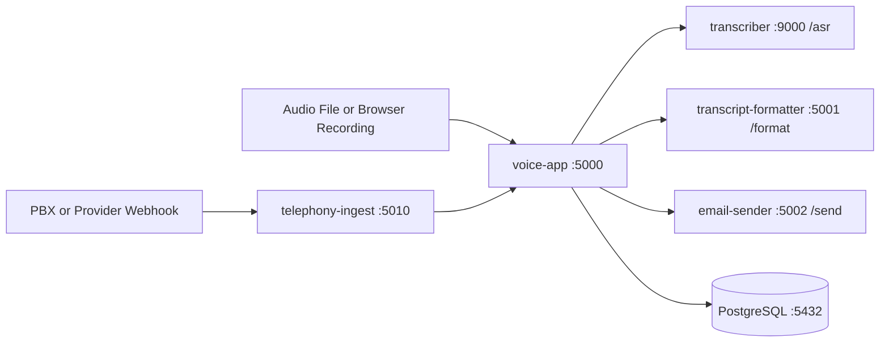

# Customer Support Call Transcription & Incident Form System

Local-first support-call pipeline with Docker Compose:
- Transcribe call audio.
- Extract structured incident fields.
- Send notification email.
- Store completed forms in PostgreSQL.
- Accept telephony recording webhooks and forward them through the same pipeline.

## Table of Contents

- [What You Get](#what-you-get)
- [Architecture](#architecture)
- [Service Map](#service-map)
- [Prerequisites](#prerequisites)
- [Start From Scratch](#start-from-scratch)
- [First Validation](#first-validation)
- [API Usage](#api-usage)
- [Configuration](#configuration)
- [Troubleshooting](#troubleshooting)
- [Stop And Reset](#stop-and-reset)
- [More Guides](#more-guides)

## What You Get

- Browser demo UI at `http://localhost:5000`.
- API flow via `curl` to `POST /upload`.
- Optional telephony ingest endpoint at `http://localhost:5010/webhooks/recording-complete`.

## Architecture



Mailpit (`:8025`) is available in `dev` profile for local inbox preview.

## Service Map

| Service | Container | Port | Purpose |
|---|---|---|---|
| `database` | `support-db` | 5432 | Incident form persistence |
| `n8n` | `support-n8n` | 5678 | Optional workflow orchestration |
| `voice-app` | `support-voice-app` | 5000 | UI + `/upload` API |
| `telephony-ingest` | `support-telephony-ingest` | 5010 | Recording webhook adapter |
| `transcriber` | `support-transcriber` | 9000 | Whisper ASR endpoint |
| `transcript-formatter` | `support-transcript-formatter` | 5001 | Local AI form filling |
| `email-sender` | `support-email-sender` | 5002 | SMTP dispatch |
| `mailpit` (`dev`) | `support-mailpit` | 8025 | Local test inbox |

## Prerequisites

- Docker Desktop (Windows/macOS) or Docker Engine + Compose plugin (Linux).
- Enough disk space for Ollama models (default `llama3.1:8b`).
- Default stack runs on CPU and works cross-platform (Linux/macOS/Windows).

## Start From Scratch

1. Clone repository and open it in terminal.
2. Copy environment template.
3. Start the stack.
4. Verify health.

Linux/macOS:

```bash
cp .env.example .env
chmod +x scripts/start-stack-auto.sh
./scripts/start-stack-auto.sh
docker compose ps
```

The `start-stack-auto.sh` script detects GPU viability and automatically chooses
GPU mode (with `docker-compose.gpu.yml`) or CPU mode.

Optional script flags:
- `./scripts/start-stack-auto.sh --dry-run`
- `./scripts/start-stack-auto.sh --min-gpu-vram-gb 10`

Optional NVIDIA GPU acceleration (Linux and Windows with Docker GPU support enabled):

```bash
docker compose -f docker-compose.yml -f docker-compose.gpu.yml --profile dev up -d --build
```

If this command fails with `could not select device driver \"nvidia\"`, your Docker
engine does not currently expose GPU support. Use CPU mode with the default command:

```bash
docker compose --profile dev up -d --build
```

Windows requirements for GPU mode:
- Docker Desktop using WSL2 backend.
- Latest NVIDIA GPU driver installed on host.
- WSL GPU support available (`wsl --update`).

Linux requirements for GPU mode:
- NVIDIA driver installed on host.
- NVIDIA Container Toolkit installed and configured for Docker.

GPU preflight checks before using `docker-compose.gpu.yml`:

Linux:

```bash
nvidia-smi
docker run --rm --gpus all nvidia/cuda:12.3.2-base-ubuntu22.04 nvidia-smi
```

Windows PowerShell (Docker Desktop + WSL2 backend):

```powershell
nvidia-smi
docker run --rm --gpus all nvidia/cuda:12.3.2-base-ubuntu22.04 nvidia-smi
```

If either Docker GPU check fails, keep using CPU mode.

Note on `buildx` warning:
- `Docker Compose requires buildx plugin to be installed` is a warning only.
- Compose falls back to the classic builder and your images still build.

Windows PowerShell:

```powershell
Copy-Item .env.example .env
./scripts/start-stack-auto.ps1
docker compose ps
```

The `start-stack-auto.ps1` script provides the same automatic mode selection for
Windows hosts.

Optional script flags:
- `./scripts/start-stack-auto.ps1 -DryRun`
- `./scripts/start-stack-auto.ps1 -MinGpuVramGb 10`

Manual mode selection (if you do not want auto-detection):

CPU mode:

```bash
docker compose --profile dev up -d --build
```

GPU mode:

```bash
docker compose -f docker-compose.yml -f docker-compose.gpu.yml --profile dev up -d --build
```

5. Pull the Ollama model into the Ollama container (one-time per machine):

Linux/macOS:

```bash
docker exec -it support-ollama ollama pull llama3.1:8b
```

Windows PowerShell:

```powershell
docker exec -it support-ollama ollama pull llama3.1:8b
```

Expected minimum status before testing:
- `support-voice-app` is running.
- `support-transcriber` is healthy (can take longer on first start).
- `support-transcript-formatter` is running.
- `support-email-sender` is running.

## First Validation

1. Open `http://localhost:5000`.
2. Upload `test_call.wav` or record audio in browser.
3. Confirm successful pipeline response.
4. Open Mailpit at `http://localhost:8025` and confirm mail arrives.

If `localhost:5000` is unreachable for a teammate:
1. Confirm service is actually running:

Linux/macOS:

```bash
docker compose ps voice-app
docker logs --tail 200 support-voice-app
```

Windows PowerShell:

```powershell
docker compose ps voice-app
docker logs --tail 200 support-voice-app
```

2. Confirm no port conflict on `5000` from another local app.
3. Confirm Ollama is up and reachable:

Linux/macOS:

```bash
docker exec -it support-ollama ollama list
```

Windows PowerShell:

```powershell
docker exec -it support-ollama ollama list
```
4. If model is missing, pull it:

```bash
docker exec -it support-ollama ollama pull llama3.1:8b
```

5. Rebuild if needed:

Linux/macOS:

```bash
docker compose --profile dev down
docker compose --profile dev up -d --build
```

Windows PowerShell:

```powershell
docker compose --profile dev down
docker compose --profile dev up -d --build
```

## API Usage

### Upload Audio

Endpoint: `POST http://localhost:5000/upload` (`multipart/form-data`)

Required field:
- `file`

Optional fields:
- `caller_name`
- `account_or_reference`
- `contact_info`

Linux/macOS:

```bash
curl -sS -X POST http://localhost:5000/upload \
  -F "file=@test_call.wav" \
  -F "caller_name=Alex Jansen" \
  -F "account_or_reference=AC-7781" \
  -F "contact_info=alex@example.com" | python3 -m json.tool
```

Windows PowerShell:

```powershell
curl.exe -sS -X POST http://localhost:5000/upload `
  -F "file=@test_call.wav" `
  -F "caller_name=Alex Jansen" `
  -F "account_or_reference=AC-7781" `
  -F "contact_info=alex@example.com"
```

### List Stored Forms

Linux/macOS:

```bash
curl -sS http://localhost:5000/forms | python3 -m json.tool
```

Windows PowerShell:

```powershell
curl.exe -sS http://localhost:5000/forms
```

### Telephony Webhook Smoke Test

Linux/macOS:

```bash
chmod +x test_telephony_ingest.sh
./test_telephony_ingest.sh
curl -sS http://localhost:5010/webhooks/example-payload | python3 -m json.tool
```

Windows PowerShell:

```powershell
bash ./test_telephony_ingest.sh
curl.exe -sS http://localhost:5010/webhooks/example-payload
```

## Configuration

Important `.env` values:

| Variable | Default | Used by |
|---|---|---|
| `POSTGRES_USER` | `support` | DB and voice-app |
| `POSTGRES_PASSWORD` | `support_secret` | DB and voice-app |
| `POSTGRES_DB` | `support_db` | DB and voice-app |
| `SUPPORT_EMAIL` | `support-team@example.com` | voice-app |
| `SMTP_HOST` | `mailpit` | email-sender |
| `SMTP_PORT` | `1025` | email-sender |
| `OLLAMA_MODEL` | `llama3.1:8b` | transcript-formatter |
| `WHISPER_MODEL` | `small` | transcriber |
| `TELEPHONY_WEBHOOK_TOKEN` | empty | telephony-ingest auth |

## Troubleshooting

1. `localhost:5000` unreachable:
   - Check `docker compose ps`.
   - Inspect `support-voice-app` logs.
   - Rebuild stack.

2. Transcription fails:
   - Check `support-transcriber` health and logs.
   - First boot can be slow due model initialization.

3. AI extraction is generic:
   - Check formatter logs.
   - Verify Ollama endpoint on host.

4. No email appears:
   - Check Mailpit (`http://localhost:8025`).
   - Verify SMTP values in `.env`.

## Stop And Reset

Linux/macOS:

```bash
docker compose --profile dev down
docker compose --profile dev down -v
```

Windows PowerShell:

```powershell
docker compose --profile dev down
docker compose --profile dev down -v
```

## More Guides

- Full test matrix: [TESTING.md](TESTING.md)
- Telephony setup and rollout notes: [TELEPHONY_SETUP.md](TELEPHONY_SETUP.md)
